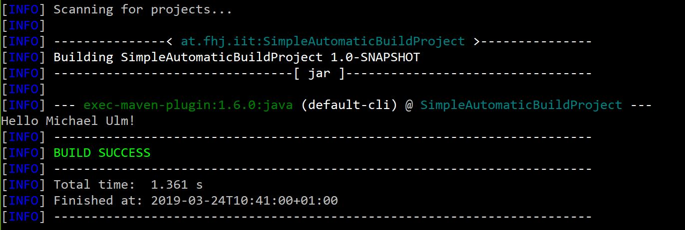

# Software Configuration Management #

**EDUCATION Repository**

## Maven Overview ##

### Maven Lifecycle ###

The Maven Lifecycle handle the sequence of process steps. Each step has a dependency to a previous step. Running for e.g.

> mvn test

will trigger the following steps

- validate
- compile
- test

Details will be explained at the [Lifecycle Reference](https://maven.apache.org/guides/introduction/introduction-to-the-lifecycle.html#Lifecycle_Reference "Maven Lifecycle Reference").

Running Maven for the first time, will download needed Repositories to the [local Repository](https://www.baeldung.com/maven-local-repository), which is located to your user home directory in the subdirectory .m2

## Ant ##

Ant works the "same way" like Maven, but there's no real standardisation. A common standard schema exists, but it's possible to extend it individually for your needs and project structure.

### Targets and Tasks ###

There are a handful of [recommended default targets](http://ant.apache.org/manual/tutorial-HelloWorldWithAnt.html), where nearly every target includes target dependency mentioned in (...):

- clean
- init
- compile (init)
- test (compile)
- jar (test)
- install
- run (jar)
- main (clean, run)

Running for e.g.

> ant test

will trigger the following steps

- init
- compile
- test

> ant run

will trigger the following steps

- init
- compile
- test
- jar
- run

### Properties for local configurations ###

It's possible to use a **build.properties** to create a environment independet build. All individual configurations are included as single Properties. A [Property](https://ant.apache.org/manual/Tasks/property.html) could be e.g. a Folder, a Output File, ...

to deliver all possible configurations just use a **build.properties.template** and add this to your Repository. Your own configuration of build.properties should be ignored in Version Control System.

## Exercise ##

### SimpleAutomaticBuildProject ###

Use [SimpleAutomaticBuildProject](SimpleAutomaticBuildProject) for understanding Steps in Build Automation. Run those mvn commands for better understanding

> mvn compile

compile your project

> mvn package

build a jar file from your project

> java -cp target\SimpleAutomaticBuildProject-1.0-SNAPSHOT.jar at.fhj.iit.Main YOUR-NAME

execute JAR File with an argument

> mvn exec:java

also execute JAR File, but by using a [Maven Plugin](https://mvnrepository.com/artifact/org.codehaus.mojo/exec-maven-plugin "Exec Maven Plugin"). Output will between the Maven Output.

After understanding Maven Build you can start to build a classic Ant Project. Use this simple [Ant build.xml Demo](build.xml "just a simple introduction for build.xml") for a first quick start.

- Restructure from Maven Project Layout to Ant Project Layout
- Create build.xml with recommended targets using common [Ant Tasks](https://ant.apache.org/manual/tasksoverview.html)
- finally run following command

> ant run

which should create same "Hello World" output with your name